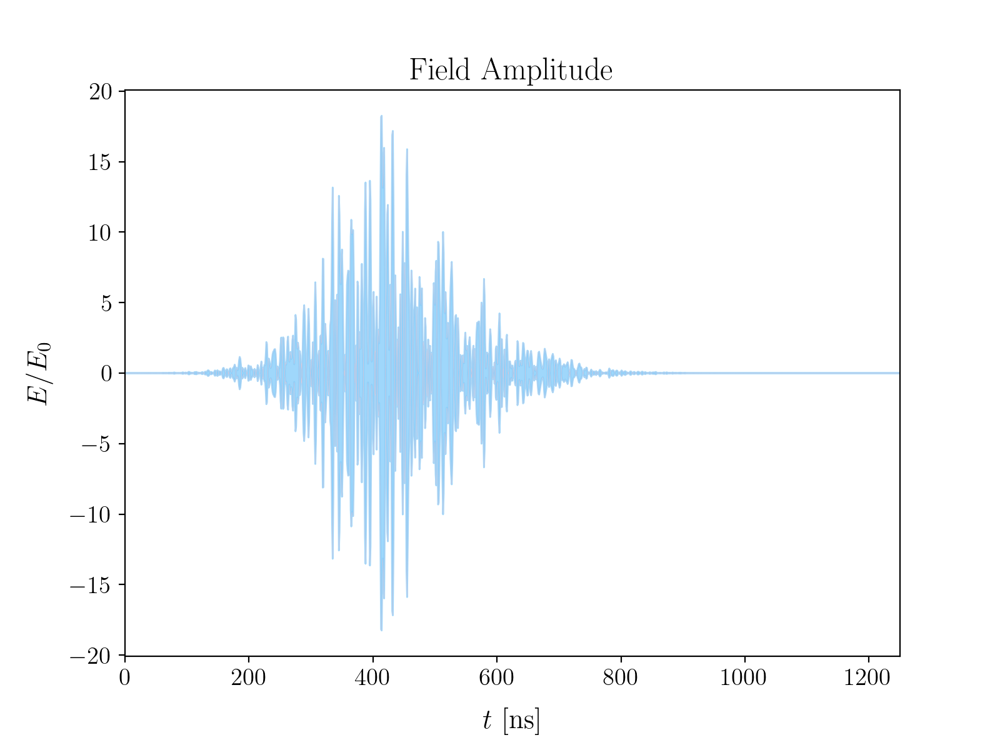
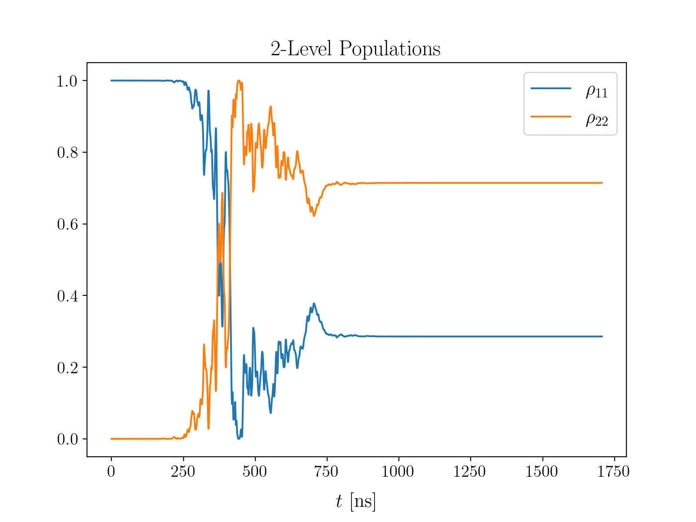

# Monte-Carlo-Bloch-Equations
### Solving the Bloch equations for 2- and 3-level systems with cavity electric fields via Monte-Carlo Methods

This code was developed during my Master's thesis on the *Modelling and Optimization of Laser Spectroscopy of the Hyperfine Ground-state in Muonic Hydrogen*
at [NOVA-SST](https://www.fct.unl.pt/en)

It aims to provide a framework in which the Bloch equations can be solved for the electric field of a laser inside a simple cavity.

This electric field is assumed be formed by the sum of successive pulse reflections inside the cavity.

<p align="center" width="100%">
     
</p>

The Doppler effect is included directly in the calculation of the electric field through the functions `cavityField_doppVel`, where a new velocity is sampled from a Maxwell-Boltzmann (MB) distribution at each pulse reflection, and `cavityField_doppPath`, where a random path motion is given to the particles, with Poisson-sampled collisions and velocities also sampled from MB distributions.

<p align="center" width="100%">
    
    
</p>
 
With suchs fields it is then possible to solve the Bloch equations numerically (Runge-Kutta 4th order) to obtain the Doppler-shifted energy level populations for 2- and 3-level systems through the function

```
solveBlochRK4_3lvl(t, rabi, params, bound)
```

where the 2-level system is treated as a particular case of the more complete 3-level system via an appropriated choice of the `params` input. 

<p align="center" width="100%">
    
    
</p>


### Observations

-This code was built for the study of the energy level populations of the ground-state hyperfine levels of muonic hydrogen, hence the very specific constants defined in constants.py

-Two possibilities where implemented for introducing the Doppler effect in the cavity electric field:
 1. `cavityField_doppVel` - new velocity sampled from a MB distribution at each pulse reflection (lighter computation)
 2. `cavityField_doppPath` - random path motion generated at each reflection (heavier computation)
    
    As far as it has been tested both implementation produce equivalent results. Note that with `cavityField_doppPath` the only effect of collisions in the field is to shift the Doppler frequency. Collision damping is still added in the population dynamics through apporpriate decay rates in the Bloch equations.
    
-`solveBlochRK4_3lvl` can be used to calculate the populations of both 2- and 3- level systems. The dynamics of these systems will depend on the input parameters of the function. 
 -The input `params` is where the detune fequency and decay rates are defined
 -The  input `rabi` carries the information about the applied electric field.
   
   
## Example Uses


#### 
