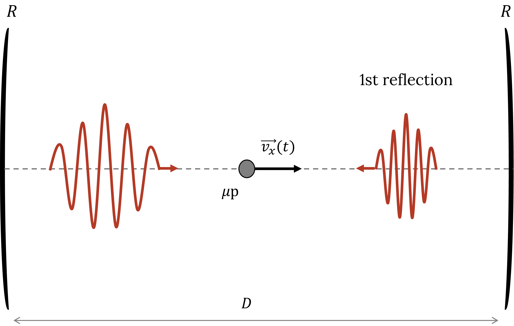
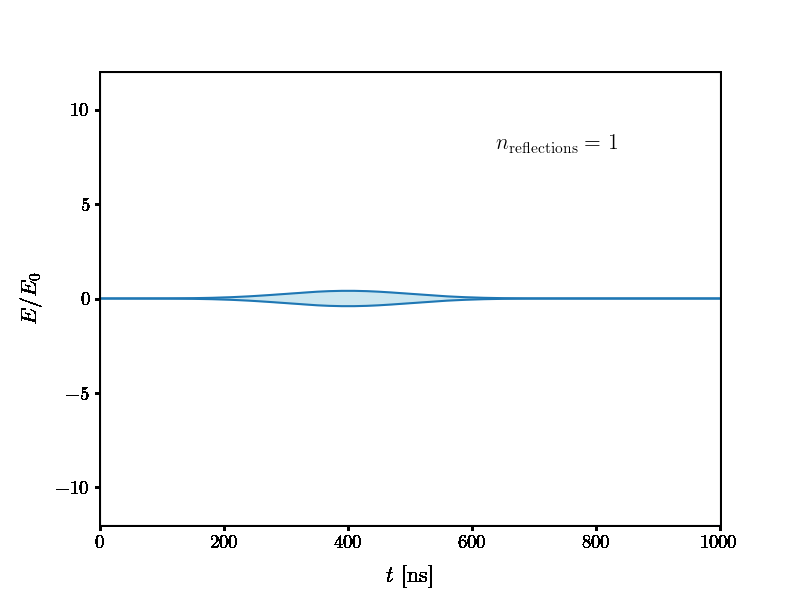
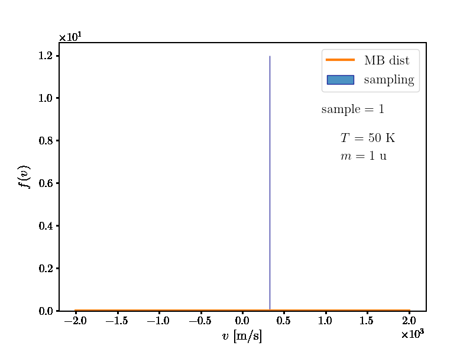

# Monte-Carlo-Bloch-Equations
### Solving the Bloch equations for 2- and 3-level systems with cavity electric fields via Monte-Carlo Methods

This code was developed during my Master's thesis on the *Modelling and Optimization of Laser Spectroscopy of the Hyperfine Ground-state in Muonic Hydrogen*
at [NOVA-SST](https://www.fct.unl.pt/en)

It aims to provide a framework in which the Bloch equations can be solved for the electric field of a laser inside a simple cavity.

This electric field is assumed be formed by the sum of successive pulse reflections inside the cavity.

     

The Doppler effect is included directly in the calculation of the electric field by sampling random velocities from Maxwell-Boltzmann distributions.

    
    

 
