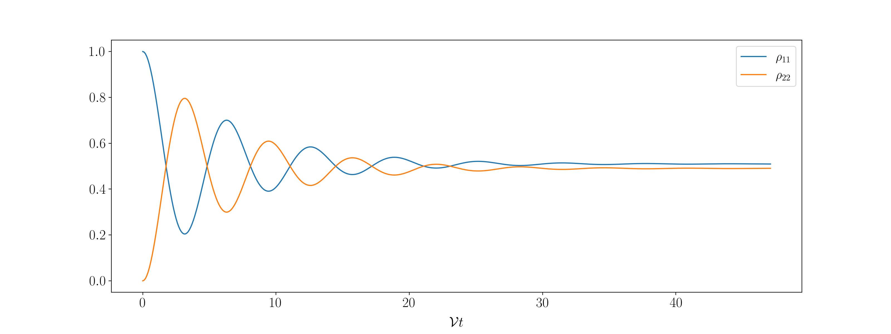

# Monte-Carlo-Bloch-Equations
### Solving the Bloch equations for 2- and 3-level systems with cavity electric fields via Monte-Carlo Methods

This code was developed during my Master's thesis on the *Modelling and Optimization of Laser Spectroscopy of the Hyperfine Ground-state in Muonic Hydrogen*
at [NOVA-SST](https://www.fct.unl.pt/en)

It aims to provide a framework in which the Bloch equations can be solved for the electric field of a laser inside a simple cavity.

This electric field is assumed be formed by the sum of successive pulse reflections inside the cavity.

<p align="center" width="100%">
     
</p>

The Doppler effect is included directly in the calculation of the electric field through the functions `cavityField_doppVel`, where a new velocity is sampled from a Maxwell-Boltzmann (MB) distribution at each pulse reflection, and `cavityField_doppPath`, where a random path motion is given to the particles, with Poisson-sampled collisions and velocities also sampled from MB distributions.

<p align="center" width="100%">
    
    
</p>
 
With suchs fields it is then possible to solve the Bloch equations numerically (Runge-Kutta 4th order) to obtain the Doppler-shifted energy level populations for 2- and 3-level systems through the function

```
solveBlochRK4_3lvl(t, rabi, params, bound)
```

where the 2-level system is treated as a particular case of the more complete 3-level system via an appropriated choice of the `params` input. 

<p align="center" width="100%">
    
    
</p>


### Observations

- Two possibilities where implemented for introducing the Doppler effect in the cavity electric field:
 1. `cavityField_doppVel` - new velocity sampled from a MB distribution at each pulse reflection (lighter computation)
 2. `cavityField_doppPath` - random path motion generated at each reflection (heavier computation)
    
    As far as it has been tested both implementations produce equivalent results. Note that with `cavityField_doppPath` the only effect of collisions in the field is to shift the Doppler frequency. Collision damping is still added in the population dynamics through appropriate decay rates in the Bloch equations.
    
- `solveBlochRK4_3lvl` can be used to calculate the populations of both 2- and 3- level systems. The dynamics of these systems will depend on the input parameters of the function. 
  - The input `params` is where the detune fequency and decay rates are defined
  - The  input `rabi` carries the information about the applied electric field.
   
   
## Example Uses

#### 1. 2-level system with constant amplitude field

Consider a 2-level system with spontaneous emission, represented by the following scheme:

<p align="center" width="100%">
    
</p>

We can obtain the energy level populations of such system with the following script:

```python
import numpy as np
import bloch

#define the time array
t = np.arange(0, 10*np.pi, 0.1)

#define the desired paramters
rabi = np.ones(shape=len(t)) #rabi frequency
detune = 0.0 #laser frequency detune
gamma_sp = 1/5 #spontaneous emission rate

params = np.array([detune, gamma_sp, 0.0, 0.0, 0.0, 0.0]) #advisable to define params as a numpy array

#bound condition
bound = np.array([1.0+0.0j, 0.0j, 0.0j, 0.0j])

#calculate the populations
rho = bloch.solveBlochRK4_3lvl(t, rabi, params, bound)

```

Producing the populations:

<p align="center" width="100%">
    
</p>


#### 2. 2-level system with Doppler-shifted cavity field

Consider now an equivalent 2-level system excited by the electric field of a laser inside a cavity. This field will have many reflections. We consider here that at each reflection the field interacts with an atom with a new velocity sampled from a MB distribution.

```python
import numpy as np
import constants as ct
import field
import bloch

#define cavity conditions
R = 0.995 #reflectivity
D = 10.0E-2 #diameter (m)

#define gas conditions
T = 50 #Temperature (K)
m = 1*ct.u #mass of the atoms (kg) 

#laser parameters
detune = 0
carrier_freq = 2*np.pi*100E6 #resonant frequency of the muH ground-state HFS transition (rad/s)
tau = 1.0E-6 #laser pulse duration (s)
bandwidth = 2*np.pi*0.5E6 #laser bandwidth (rad/s)

minAmp = 0.01 #amplitude percentage of the last calculated reflection (=1% of the emitted pulse's amplitude)

t0 = 4*tau #arrival of the emitted pulse at the center of the cavity

#calculate the field
Efield, t,_ = field.cavityField_doppVel(tau, t0, D, R, m, T, carrier_freq, minAmp) 

#rabi frequency
rabiAmp = 2*np.pi*1.0E6 #max rabi frequency
rabi = rabiAmp*Efield/field.normConst_gaussSq(tau)

#define paramters for Bloch equations
params = np.array([detune, 0.0, 0.0, 0.0, 0.0, bandwidth]) #advisable to define params as a numpy array

#bound condition
bound = np.array([1.0+0.0j, 0.0j, 0.0j, 0.0j])

#calculate the populations
rho = bloch.solveBlochRK4_3lvl(t, rabi, params, bound)
```

For such a field we obtain the followin populations:

<p align="center" width="100%">
    
</p>

**Note:** The population dynamics will be different at each run, given that the field has a certain random nature.


